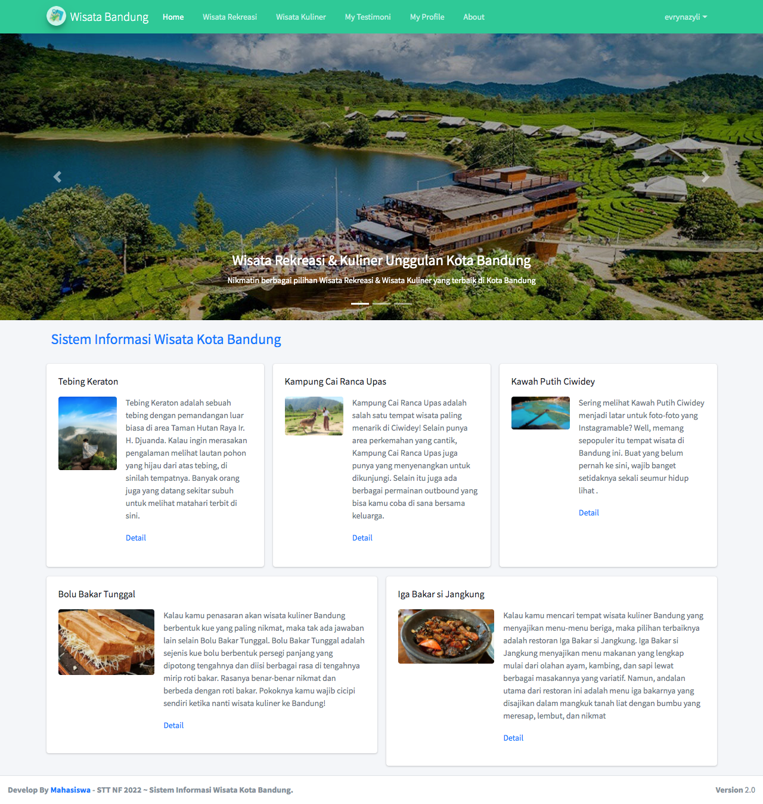
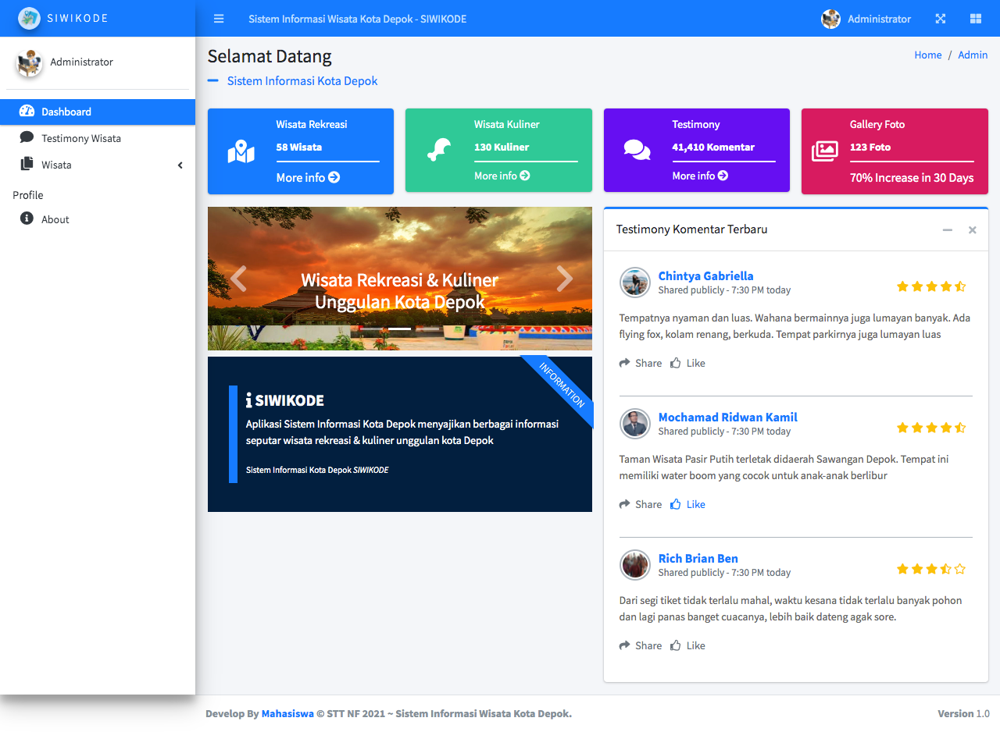

# Aplikasi Sistem Informasi Wisata
### Pemrograman WEB Lanjutan 
Aplikasi Sistem Informasi menyajikan berbagai informasi seputar wisata rekreasi & kuliner unggulan
- Develop by Mahasiswa
- STT Terpadu Nurul Fikri
- Teknik Informatika

## Environment
* Download [DATABASE MYSQL] : [Download](db_wisata.sql)

```sh
Setting database configuration in application/config/database.php
```
Verify the deployment by navigating to your server address in
your preferred browser, example : 
```sh
127.0.0.1/sistem_informasi_wisata
http://localhost/sistem_informasi_wisata
```
### Demo
Demo can be found at : 
> Note `Sistem Informasi Wisata WEB :` https://nazyli.com/


### Screenshots
  
 \


### Contributing
Pull requests are welcome. For major changes, please open an issue first to discuss what you would like to change.

Please make sure to update tests as appropriate.

### License
[MIT](https://choosealicense.com/licenses/mit/)

**Free Software, Hell Yeah!**
